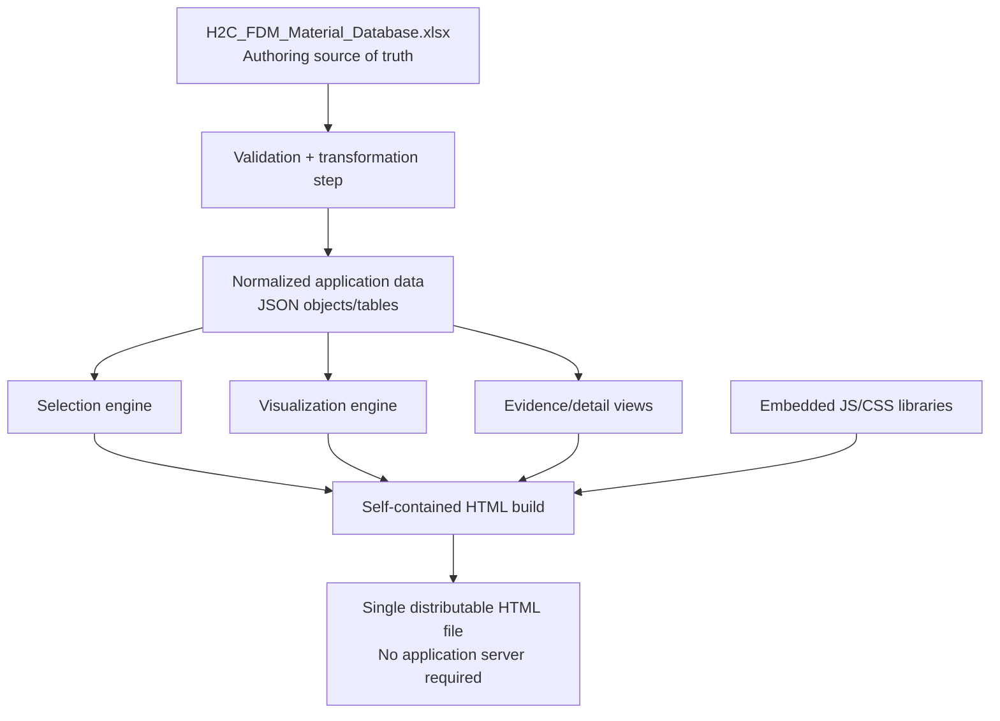
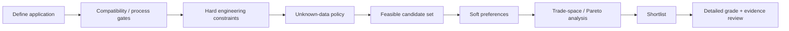

# H2C FDM Material Selection Tool
## Product and Solution Architecture Brief

**Audience:** Product Manager, Solution Architect, engineering stakeholders, and future developers  
**Status:** Architecture and product-direction document  
**Database snapshot:** 2026-09-10  
**Fixed implementation decision:** The end-user product will be a **self-contained interactive HTML material-selection application**.  

---

## 1. Executive Summary

This project starts from an existing, research-oriented material database for FDM filaments relevant to a fully configured Bambu Lab H2C printer. The database is not intended to be expanded or materially changed at this stage. The immediate objective is to turn the existing data into a **material-selection and engineering decision-support tool**.

The current data assets are substantially more rigorous than a typical filament comparison spreadsheet. The master scope contains **96 H2C-relevant material entries plus six excluded high-temperature materials**, while the Excel database separates canonical materials, commercial grades, print profiles, individual property measurements, use/durability evidence, Canadian price observations, sources, and explicit research gaps/conflicts. This separation should be preserved.

The recommended product architecture is:

1. **Keep the existing Excel workbook as the V1 authoring/source-of-truth database.**
2. Add a small, deterministic **build/validation step** that converts the workbook into normalized application data, preferably JSON.
3. Bundle that normalized data, the selection logic, the user interface, and all required JavaScript libraries into **one distributable HTML file**.
4. Make the selector operate as an engineering workflow: **feasibility gates -> hard constraints -> unknown-data handling -> soft preferences -> Pareto/trade-space analysis -> shortlist -> detailed evidence review**.
5. Make **interactive Ashby-style material-property plots** a primary analysis tool rather than a decorative chart.
6. Preserve traceability from every displayed headline value back to the underlying **MaterialID, GradeID, MeasurementID, test conditions, and SourceID**.
7. Avoid universal “best material” scores as the primary decision method. Scores can be offered as optional preference tools after mandatory constraints have been satisfied.

The resulting product should feel simple enough for a user who wants to answer “what should I print this part from?” while retaining enough depth for an engineer to ask “which exact measurement, grade, orientation, moisture state, and standard produced this number?”

---

# 2. Project Context

## 2.1 What exists today

Two source artifacts define the present scope:

- **Bambu_H2C_Consolidated_Filament_Material_Master_List.md**: the canonical material scope and taxonomy. It contains 96 H2C-relevant entries and a separate set of six industrial high-temperature materials that were intentionally excluded from normal H2C use.
- **H2C_FDM_Material_Database.xlsx**: the research database containing material identities, exact commercial grades, printing data, measured properties, environmental/use evidence, pricing, source records, and coverage/conflict records.

The workbook is already structured as a relational-style dataset rather than a single flat table. Its principal sheets are:

| Data entity | Approximate records | Purpose |
|---|---:|---|
| Materials | 102 | Canonical material identities and headline observations |
| Grades | 136 | Exact commercial formulations/products tied to materials |
| Print setup | 156 | Grade/material-specific processing guidance and H2C routing |
| Properties | 1,807 | Individual measured or published property observations |
| Use & durability | 362 | Qualitative and semi-quantitative application/environment evidence |
| Prices CA | 104 | Canadian price observations and normalization basis |
| Sources | 214 | Traceable source register |
| Coverage | 1,106 | Explicit gaps, conflicts, and unresolved research items |
| Method | 39 rules after the header | Interpretation, normalization, comparison, and evidence rules |

This is a strong foundation because the workbook intentionally distinguishes concepts that are often incorrectly collapsed in material databases. Examples include:

- XY versus Z direction;
- printed specimen versus resin/filament/unspecified specimen;
- tensile yield versus tensile break versus unspecified tensile strength;
- HDT versus glass-transition temperature, Vicat, melting point, and continuous-service temperature;
- published values versus missing data versus unresolved/conflicting data;
- generic polymer families versus exact commercial formulations;
- source claims versus independent validation.

The application architecture must preserve these distinctions.

## 2.2 What the product is intended to become

The target is a **self-contained browser application for FDM material selection**, initially centered on the Bambu H2C and the current database snapshot.

Typical use cases include:

- “I need an outdoor structural part above 80 °C. What materials remain?”
- “I need the lightest material above a stiffness threshold.”
- “Compare PA6-CF, PET-CF, PC-CF, and PPA-CF.”
- “Show stiffness versus density for materials the H2C can actually print.”
- “What is the tradeoff between thermal capability and price?”
- “Which candidate has the strongest evidence base rather than simply the highest reported number?”
- “Why was this material rejected by my constraints?”
- “Where did this value come from and under what test conditions was it measured?”

## 2.3 What the product is not

The selector should explicitly **not** present itself as:

- a source of certified design allowables;
- a substitute for exact-grade TDS/SDS review;
- a guarantee of H2C compatibility for every third-party formulation;
- a tool that converts missing data into assumed zero values;
- a universal material-ranking engine;
- a tool that silently treats incompatible test conditions as equivalent;
- a replacement for fatigue, creep, chemical, regulatory, or safety validation when those issues govern the design.

Its role is **decision support, screening, comparison, and evidence navigation**.

---

# 3. Core Product Principles

The following principles should govern the product and implementation.

## 3.1 Preserve evidence, do not flatten it

The current workbook's strength is that a displayed material headline can be traced back to specific measurements and sources. The application should generate convenient summary views, but it should not replace the underlying evidence model with one large denormalized table.

## 3.2 Separate feasibility from preference

A material that fails a mandatory requirement should not become the recommended material because it scores highly on unrelated properties.

For example, a material that cannot meet the thermal requirement should not be rescued by being inexpensive and stiff.

Therefore:

> **Hard constraints determine eligibility. Soft preferences rank or compare eligible candidates.**

## 3.3 Missing data is information

“Not published,” “not comparable,” “conflicting,” and “not applicable” are different engineering states. They must remain different in the application.

## 3.4 Exact grade data must remain distinguishable from family-level identity

The tool may let users select at the canonical-material level, but deep comparison must show which exact grade produced the displayed observation.

## 3.5 Progressive disclosure

A user should not need to understand the full data model to use the selector. The UI should show a small amount of decision-relevant information first and allow deeper inspection on demand.

## 3.6 The application must explain its decisions

Every exclusion, warning, ranking, and selected value should be explainable.

The product should be able to answer:

- Why did this candidate pass?
- Why did this candidate fail?
- Which criteria could not be evaluated?
- Which measurements were used?
- What assumptions did the user introduce?

---

# 4. Terminology and Data Model

A shared vocabulary is important because several layers of “material” exist in the data.

## 4.1 Canonical material

A canonical material is the selection-level identity represented by `MaterialID`.

Examples:

- PLA
- PLA Basic
- PA6-CF
- PET-CF
- PPS-CF
- PC-ABS

This is normally what the user first sees in search and filtering.

## 4.2 Grade

A grade is an exact commercial formulation represented by `GradeID`.

Examples include a specific Bambu, Polymaker, 3DXTECH, FormFutura, or other manufacturer's product.

A canonical material may have one or several grade records.

## 4.3 Measurement

A measurement is a specific property observation represented by `MeasurementID` and includes context such as:

- property type;
- raw and normalized value;
- unit;
- range or uncertainty;
- specimen type;
- direction;
- moisture state;
- post-processing;
- temperature;
- standard/load;
- print parameters;
- source.

This is the fundamental unit of quantitative evidence.

## 4.4 Print profile

A print profile records process guidance and H2C-related information including nozzle, bed, chamber, enclosure, plate, drying, nozzle requirements, AMS/H2C routing, support pairing, and processing limitations.

## 4.5 Evidence record

Use/durability records capture claims and observations that often cannot responsibly be reduced to a single number, such as chemical resistance, environmental durability, or other application evidence.

## 4.6 Source

Every important statement or measurement should remain traceable to a source record.

## 4.7 Coverage record

Coverage records document what is missing, unresolved, conflicting, or insufficiently comparable.

These records should be surfaced as **data-quality/coverage information**, not treated as data values.

---

# 5. Target System Architecture

The recommended architecture deliberately separates the **authoring database**, **build-time application dataset**, and **runtime application**.



## 5.1 Recommended V1 data pipeline

```text
Excel source of truth
        |
        | validate IDs, required fields, enums, units, references
        v
Normalized JSON snapshot
        |
        | bundle into application
        v
Single self-contained HTML
```

The HTML should include:

- application UI;
- normalized material database snapshot;
- selection/filter engine;
- Plotly or equivalent plotting library;
- Tabulator or equivalent data-grid library;
- CSS/icons/assets required by the UI;
- version metadata describing which database snapshot was embedded.

No live backend is required for V1.

## 5.2 Why not make the HTML read the Excel workbook every time?

A browser can parse an XLSX file using libraries such as SheetJS, but that is not the preferred production architecture for this project.

Using Excel only at runtime would:

- couple the UI directly to workbook layout;
- make schema changes harder to control;
- require file-selection or browser file access when run locally;
- push validation problems into the end-user session;
- make the production build less deterministic;
- make application logic depend on Excel-specific representation.

Instead, Excel should be treated as an **authoring format**, while JSON becomes the **compiled runtime representation**.

---

# 6. Question 1 - How Should the Filaments Be Organized?

## 6.1 The problem

A single tree such as:

`Nylon -> PA6 -> PA6-CF`

is useful, but insufficient. Filaments belong to several simultaneous classifications: polymer chemistry, reinforcement, functional role, H2C support status, flexibility, flame retardancy, ESD behavior, commercial grade, and so on.

Trying to encode every attribute into one hierarchy creates awkward categories and duplicated records.

## 6.2 Options

### Option A - One strict hierarchical tree

Example:

```text
Engineering
  Nylon
    PA6
      PA6-CF
      PA6-GF
```

**Advantages**
- Easy to understand.
- Simple navigation.

**Disadvantages**
- A material can only appear naturally in one branch.
- Cross-cutting properties such as CF/GF/ESD/FR are poorly represented.
- Becomes unstable as the database expands.

### Option B - Flat material list with tags

Every material is independent and receives descriptive tags.

**Advantages**
- Flexible.
- Good for search.

**Disadvantages**
- Weak conceptual structure.
- Harder for users to learn material relationships.

### Option C - Primary identity hierarchy plus orthogonal facets **(recommended)**

Use one simple identity hierarchy and represent other characteristics as independent searchable/filterable dimensions.

Recommended identity model:

```text
Polymer family -> canonical formulation -> commercial grade
```

Examples:

```text
Nylon / Polyamide -> PA6-CF -> exact manufacturer grades
Polycarbonate -> PC-CF -> exact manufacturer grades
PLA -> PLA Matte -> Bambu PLA Matte
```

Independent facets then include:

- base polymer;
- modifier/filler;
- material role;
- H2C status;
- reinforcement;
- flexibility;
- support material status;
- electrical behavior;
- flame-retardant status;
- manufacturer;
- source/evidence status.

## 6.3 Recommendation

Use the current `MaterialID` as the canonical top-level selection object and `GradeID` for exact formulations.

The UI should let a user browse by family but filter across facets.

The user should normally select **canonical materials first** and drill down to grades when evidence or procurement decisions require it.

---

# 7. Question 2 - How Should the Data Be Organized?

## 7.1 Recommendation: preserve the normalized relational structure

The workbook already has the correct conceptual organization. Do not flatten it into a master CSV or giant table.

The application data model should preserve entities comparable to:

```text
materials
  MaterialID PK

materials 1 ---- N grades
materials 1 ---- N measurements
grades    1 ---- N measurements
materials 1 ---- N printProfiles
grades    1 ---- N printProfiles
materials 1 ---- N evidenceRecords
materials 1 ---- N priceObservations
measurements N ---- 1 sources
profiles     N ---- 1 sources
evidence     N ---- 1 sources
materials 1 ---- N coverageRecords
```

## 7.2 Add derived views, not duplicate truth

For usability the application should create derived objects such as a `materialSummary`, but they should be generated from the canonical data.

Example:

```json
{
  "materialId": "M050",
  "name": "PA6-CF",
  "family": "Nylon / Polyamide",
  "headline": {
    "density": {...},
    "tensileModulusXY": {...},
    "tensileStrengthXY": {...},
    "hdt045": {...},
    "priceCADkg": {...}
  },
  "coverage": {...}
}
```

Each headline object should retain the associated measurement or evidence identifier rather than copying an unexplained number.

## 7.3 Separate four categories of information

The UI and data layer should distinguish:

1. **Identity data** - what the material is.
2. **Measured/published technical data** - what was measured and under what conditions.
3. **Manufacturing data** - what is required to print it.
4. **Evidence/metadata** - source, uncertainty, coverage, conflicts, and limitations.

This separation prevents a number such as 120 °C from losing its meaning when it is actually HDT under a specific load rather than continuous use temperature.

---

# 8. Question 3 - Which Properties and Capabilities Should Be Used First?

The product should expose the most decision-relevant and sufficiently populated dimensions first, without hiding deeper data.

## 8.1 Current headline-data availability

The current material sheet has the following approximate numeric coverage across 102 canonical material entries:

| Headline field | Numeric coverage |
|---|---:|
| Density | 88 / 102 |
| Tensile modulus XY | 70 / 102 |
| Elongation at break XY | 72 / 102 |
| HDT at 0.45 MPa | 66 / 102 |
| Tensile strength XY | 52 / 102 |
| Canadian price | 40 / 102 |
| Printability 1-5 numeric rubric | 10 / 102 |

This immediately suggests that the interface should not make the current numeric printability score a dominant V1 ranking axis. It is too sparsely assigned and is intentionally an analyst screening rubric rather than a measured physical property.

## 8.2 Recommended V1 selection domains

### A. Feasibility and compatibility

These should appear first because they can eliminate candidates before performance comparison.

- H2C status;
- nozzle-temperature requirement;
- bed-temperature requirement;
- chamber/enclosure requirement;
- nozzle material/abrasion requirement;
- nozzle diameter constraints;
- H2C left/right routing information;
- AMS/AMS HT information when supported;
- drying/storage requirements;
- support-material compatibility;
- low/high-temperature material-group conflicts.

### B. Mechanical

Primary:

- density;
- tensile modulus;
- tensile strength, carefully labelled by endpoint;
- elongation at break.

Secondary/deep view:

- flexural properties;
- compressive properties;
- impact metrics;
- fracture metrics;
- fatigue;
- creep/relaxation.

The latter group must remain condition-aware and should not be reduced to false universal rankings.

### C. Thermal

Primary:

- HDT with load explicitly shown.

Deep view:

- Tg;
- Vicat;
- melting point;
- continuous-service rating where genuinely published;
- CTE and dimensional-change information.

These metrics must remain distinct.

### D. Environment and durability

Potential filters/tags:

- outdoor/UV evidence;
- moisture sensitivity;
- chemical-resistance evidence;
- water exposure;
- dimensional stability;
- long-term load concerns;
- known application limitations.

Many of these should be categorical/evidence-based rather than invented numerical scores.

### E. Economic and procurement

- CAD/kg;
- exact grade/manufacturer;
- current sampled availability;
- package size;
- retailer;
- whether the price is eligible for the headline sample.

### F. Data quality and evidence

This should be treated as a first-class domain:

- exact-grade evidence available;
- number of measurements available;
- unresolved conflicts;
- missing critical properties;
- source class;
- whether the current result depends on assumptions.

## 8.3 Recommendation

The V1 default selector should emphasize approximately **10-15 high-value controls**, not every property in the database.

Everything else remains available under an **Advanced** panel and in the material-detail page.

---

# 9. Question 4 - How Should Characteristics Be Organized and Filtered?

## 9.1 Recommended decision flow



## 9.2 Step 1 - Application framing

The user can optionally begin with an application template such as:

- indoor prototype;
- outdoor structural part;
- warm/hot environment;
- lightweight structure;
- high-stiffness fixture;
- flexible component;
- chemically exposed component;
- support/interface material.

Templates should **pre-populate controls**, not secretly make the decision.

## 9.3 Step 2 - Compatibility gates

Examples:

- H2C-relevant only;
- officially supported/validated status;
- maximum available nozzle temperature;
- required enclosure/chamber;
- available hardened nozzle;
- acceptable AMS route.

These gates define whether a material can reasonably enter the engineering comparison.

## 9.4 Step 3 - Hard engineering constraints

Examples:

```text
Density <= 1,400 kg/m3
Tensile modulus >= 3 GPa
HDT 0.45 MPa >= 100 C
Price <= CAD 100/kg
Outdoor evidence required
```

Each constraint returns one of four states:

- **PASS**
- **FAIL**
- **UNKNOWN**
- **NOT COMPARABLE / INDETERMINATE**

Do not reduce this to Boolean true/false.

## 9.5 Step 4 - Unknown-data policy

The user should be able to choose:

### Strict engineering mode

Unknown or non-comparable data does **not** satisfy a mandatory constraint.

Use when screening for a design decision that requires evidence.

### Exploration mode

Unknown candidates remain visible with a prominent **Needs verification** state.

Use when the purpose is discovery and research planning.

## 9.6 Step 5 - Soft preferences

After hard constraints, the user may say:

- lower price is better;
- lower density is better;
- higher stiffness is better;
- higher elongation is preferred;
- easier manufacturing is preferred.

These preferences can feed:

- sorting;
- normalized optional scores;
- Pareto analysis;
- visual trade-space tools.

They must not override a failed mandatory constraint.

## 9.7 Step 6 - Pareto analysis

The application should identify **non-dominated candidates**.

Example:

If Material A is:

- cheaper than Material B;
- lighter than Material B;
- at least as stiff as Material B;
- and no worse on the selected thermal criterion,

then B may be dominated within that chosen decision space.

A Pareto frontier is often more informative than assigning one universal ranking number.

## 9.8 Filter behavior

Filters should be grouped by domain rather than alphabetically:

```text
Compatibility
Mechanical
Thermal
Environment
Manufacturing
Cost
Evidence / data quality
Advanced test-condition controls
```

The UI should continuously show:

- total candidates;
- candidates passing;
- candidates failing;
- candidates held because of unknown data.

---

# 10. Question 5 - How Should Unknown, Estimated, and Range Data Be Handled?

This is one of the most important engineering-design decisions in the product.

## 10.1 Recommended data states

At minimum support:

| State | Meaning | Numerical use |
|---|---|---|
| Published value | Direct numeric evidence | Yes |
| Published range | Source gives interval | Yes, as interval |
| Value +/- uncertainty | Source gives uncertainty term | Yes, preserve uncertainty |
| Not published | Not found in sampled source set | No |
| Insufficient comparable data | Evidence exists but cannot support the comparison | No |
| Conflict / quarantined | Source or transcription issue unresolved | No |
| Not applicable | Property does not apply | No |
| User assumption | Temporary scenario input | Only inside that scenario |

## 10.2 Do not automatically impute missing properties

The application should not infer a PA6-CF property from:

- a generic PA-CF value;
- a different brand;
- an adjacent polymer;
- a family average;
- an LLM-generated estimate.

Such inference can be offered only as an **explicit user-created scenario assumption**, clearly visually separated from source data.

## 10.3 Range-aware constraint logic

Suppose the requirement is:

> HDT >= 100 °C

Then:

- source range 110-130 °C -> **PASS**;
- source range 70-90 °C -> **FAIL**;
- source range 90-120 °C -> **INDETERMINATE**, because the requirement cuts through the reported interval.

The same principle applies to uncertainties and bounds.

## 10.4 User assumptions

The tool may let an engineer temporarily specify:

> For this scenario, assume unknown HDT = 100 °C.

If so:

- the assumption must be shown in the scenario summary;
- the candidate must be marked as assumption-dependent;
- the original database must remain unchanged;
- exported reports must distinguish observed values from assumed values.

## 10.5 Evidence coverage instead of fake confidence

Avoid a generic “confidence = 83%” score unless a defensible statistical model exists.

Instead display coverage directly, for example:

```text
Mechanical requested fields: 4 / 5 available
Thermal requested fields: 2 / 3 available
Exact-grade evidence: Yes
Unresolved conflicts: 1
Assumptions used in this scenario: 0
```

This is transparent and actionable.

---

# 11. Question 6 - What Should the UX and Workflow Be?

The UI should support two users at the same time:

1. the user who wants a quick shortlist;
2. the engineer who wants to investigate the evidence.

The solution is **progressive disclosure**.

## 11.1 Recommended top-level navigation

Four primary workspaces are sufficient for V1:

### 1. Explore

A searchable catalogue of all materials.

Purpose:

- browse;
- learn the material taxonomy;
- inspect families;
- directly open a material.

### 2. Select

The main decision workflow.

Purpose:

- define compatibility gates;
- define hard constraints;
- choose unknown-data policy;
- apply preferences;
- see live candidate counts;
- open plots.

### 3. Compare

A focused comparison workspace for approximately 2-6 shortlisted materials.

Purpose:

- aligned property comparisons;
- condition/source inspection;
- differences and tradeoffs;
- evidence completeness;
- price/process comparison.

### 4. Material Detail

The complete engineering record for one canonical material or grade.

Recommended tabs:

```text
Overview
Mechanical
Thermal
Printing
Environment & durability
Grades
Price
Evidence & sources
Coverage / unresolved issues
```

## 11.2 Suggested Select-screen layout

```text
+--------------------------------------------------------------------------------+
| H2C Material Selector     [Search]                 Shortlist (4)   Scenario ... |
+----------------------+---------------------------------------------------------+
| FILTERS              |  27 candidates                                  View   |
|                      |  [Table] [Ashby] [Parallel] [Coverage]                  |
| Compatibility        |                                                         |
| Mechanical           |   Candidate results / interactive visualization         |
| Thermal              |                                                         |
| Environment          |                                                         |
| Manufacturing        |                                                         |
| Cost                 |                                                         |
| Evidence             |                                                         |
| Advanced conditions  |                                                         |
+----------------------+---------------------------------------------------------+
| PASS 19 | UNKNOWN 8 | FAIL 75   [Explain exclusions]                          |
+--------------------------------------------------------------------------------+
```

## 11.3 Why/explainability interaction

Every candidate should have an **Explain** or **Why?** action.

Example:

```text
PA6-CF

PASS  HDT >= 100 C
PASS  Modulus >= 3 GPa
PASS  Density <= 1,500 kg/m3
UNKNOWN  Outdoor UV criterion - insufficient exact-grade evidence
FAIL  Preferred price <= CAD 80/kg   [soft preference only]
```

The same mechanism can explain excluded candidates.

## 11.4 Scenario persistence

Because the application is self-contained and has no server, user state can be handled with:

- browser `localStorage` for personal saved scenarios/preferences;
- export/import of a small scenario JSON file;
- URL hash/query serialization for shareable filter states when practical.

Canonical material data should remain embedded and read-only.

---

# 12. Question 7 - How Should Plots, Charts, and Comparisons Be Used?

Visualization should be part of the **selection mechanism**, not merely reporting after the selection is complete.

The most important visualization family for this product is the **interactive Ashby-style property-property plot**.

---

## 12.1 Ashby-style plots: why they are central

Traditional material selection frequently involves competing properties rather than one property in isolation. A material may be strong but dense, light but flexible, inexpensive but thermally limited, or high-temperature but difficult to print.

An Ashby-style plot puts two quantitative properties on the X and Y axes and makes the trade space visible.

Examples relevant to this database include:

- tensile modulus vs density;
- tensile strength vs density;
- HDT vs price;
- tensile modulus vs elongation;
- tensile strength vs elongation;
- HDT vs tensile modulus;
- tensile strength vs CAD/kg;
- density vs CAD/kg;
- CTE vs HDT when sufficient comparable data exist.

The axes must always display the exact property definition and unit.

---

## 12.2 Make the axes user-selectable

Do not hard-code only three charts.

The user should be able to choose any pair from a controlled list of compatible normalized numeric properties.

Example control:

```text
X-axis: [Density kg/m3               v]
Y-axis: [Tensile modulus XY GPa      v]
Scale:  [Log X] [Log Y]
Point level: [Canonical headline | Individual grade measurements]
```

The property selector should prevent nonsensical or unsupported combinations where possible.

---

## 12.3 Linear versus logarithmic axes

Classic Ashby charts often use logarithmic axes because engineering material properties can span orders of magnitude. Plotly supports logarithmic axes directly.

For this FDM-only dataset, the property range may sometimes be narrow enough that linear scaling is more intuitive.

Therefore:

- provide **linear/log toggles** independently for X and Y;
- use log as a recommended/default mode only where appropriate;
- never use log when the displayed values can be zero or negative;
- remember that log scale visually represents ratios rather than additive differences.

---

## 12.4 Canonical-material mode versus measurement mode

Two plot modes are recommended.

### Mode A - Selection headline

One point per canonical material using the same headline logic used elsewhere in the selector.

**Use for:** fast screening.

### Mode B - Evidence/measurement

Show the underlying grades and/or individual compatible measurements.

**Use for:** engineering investigation.

This distinction prevents a clean selection chart from becoming cluttered while preserving the ability to see the evidence behind a point.

---

## 12.5 Do not silently mix incompatible conditions

This is essential.

The Ashby chart should have an **advanced comparability control** for relevant property pairs:

- XY / Z / all directions;
- printed specimen / molded or other specimen type;
- moisture condition;
- annealed / unannealed;
- test temperature;
- standard;
- notch condition for impact;
- other property-specific test settings.

If the chart combines different conditions, that fact should be visible.

A useful UI pattern is:

```text
Comparability: [Strict v]

Strict: only measurements matching selected condition model
Broad: include differing conditions but encode them visibly
```

---

## 12.6 Encode taxonomy carefully

Recommended default visual channels:

- **color** = polymer family;
- **marker shape** = modifier/reinforcement class such as unfilled / CF / GF / other;
- **marker outline or opacity** = H2C status or evidence status;
- **marker size** = optional third quantitative variable, such as price.

Do not encode five or six variables at once. The plot becomes unreadable.

A practical rule is **two axes + two categorical encodings + at most one size encoding**.

---

## 12.7 Uncertainty, bounds, and ranges

Plotly supports horizontal/vertical symmetric and asymmetric error bars. Use them when the database contains a genuine uncertainty term or range.

Possible representations:

- error bars for +/- values;
- asymmetric bars for lower/upper ranges;
- lightly filled range bands when the representation is justified;
- a special marker for unresolved/interval-overlapping constraints.

Do not invent error bars from family spread unless the chart explicitly says that it is showing variation across samples rather than measurement uncertainty.

---

## 12.8 Constraint overlays

One of the strongest features is to draw the user's constraints directly on the plot.

Example:

```text
Density <= 1,400 kg/m3
Modulus >= 3 GPa
```

The chart can show:

- vertical threshold line at density = 1,400;
- horizontal threshold line at modulus = 3;
- shaded feasible quadrant;
- faded points outside the feasible region.

This makes the filter logic visible rather than hidden in a sidebar.

---

## 12.9 Performance-index lines

A more advanced Ashby feature is the display of **constant-performance-index lines**.

These are powerful, but they should only be used when the underlying design model is appropriate.

For example, certain minimum-mass structural problems lead to indices involving combinations of stiffness/strength and density. The exact exponent depends on the geometry and loading mode.

Therefore the application should not simply offer a generic “best strength-to-weight” line.

A future advanced control should instead be:

```text
Performance index:
[None]
[Curated engineering index ...]
[User-defined expression ...]
```

Each curated index should include:

- the governing design case;
- the formula;
- assumptions;
- which direction is better;
- a short explanation of why the slope of the constant-index line has that value on a log-log chart.

This turns the Ashby chart from a visualization into a genuine material-selection tool.

---

## 12.10 Pareto frontier overlay

For any two axes where “better” direction is known, the chart can show the Pareto frontier of the currently eligible candidates.

Example:

- lower density is better;
- higher modulus is better.

The frontier immediately identifies candidates that are not dominated in that two-property decision space.

Important: the frontier is conditional on the current filters and chosen dimensions. It is **not a universal ranking**.

---

## 12.11 Hover and click behavior

Hover should show decision-relevant information without requiring a click:

```text
PA6-CF
Modulus: 4.8 GPa
Density: 1,180 kg/m3
Grade used: ...
Direction: XY
Condition: dried / as reported
Source: ...
Status: passes current hard constraints
```

Clicking a point should:

- select/highlight it in the table;
- optionally add it to the shortlist;
- open the detail drawer.

Brushing/lasso selection should allow a user to select a region of the trade space and turn it into a candidate subset.

---

## 12.12 Labels and clutter management

Do not permanently label all points.

Recommended behavior:

- labels on hover;
- persistent labels only for shortlisted/pinned materials;
- optional labels for Pareto-front points;
- family legend with interactive hide/show;
- faded excluded points if the user enables “show failed candidates.”

---

## 12.13 Material-family envelopes

Traditional Ashby charts often show broad material-class envelopes. This database is different: it contains specific FDM materials and grade-specific observations.

Family envelopes should therefore be used carefully.

Only draw an envelope if:

- enough comparable measurements exist;
- conditions are sufficiently similar;
- the envelope is labelled as the spread of the current sampled data, not a universal property range for the polymer family.

Otherwise use individual points.

---

# 13. Other Recommended Visualizations

Ashby plots should be primary, but several other chart types solve different tasks.

## 13.1 Parallel-coordinates plot

Recommended for a filtered set of perhaps 10-30 candidates across multiple numeric dimensions.

Possible axes:

```text
Density | Modulus | Strength | Elongation | HDT | Price
```

Plotly's parallel-coordinates plot allows interactive axis brushing, which means the visualization itself can act as another filter.

Use it after the candidate set has been reduced; 100+ lines will become visually noisy.

## 13.2 Aligned comparison bars with uncertainty

For a shortlist of 2-6 candidates, use separate aligned horizontal bars for each property.

Example:

```text
Tensile modulus
PA6-CF   |================== 4.8
PET-CF   |================  4.3
PC-CF    |============      3.2
```

If bounds exist, show them.

This is generally more interpretable than placing raw engineering properties on a radar chart.

## 13.3 Qualitative evidence heatmap

Use a matrix for categories such as:

- UV/outdoor evidence;
- moisture sensitivity;
- chemical categories;
- drying requirement;
- enclosure need;
- abrasion;
- support compatibility;
- H2C route;
- data completeness.

Cells can represent states such as:

```text
Supported / positive evidence
Limited / conditional
Negative evidence
Unknown
Conflict
Not applicable
```

Avoid converting every state to an arbitrary 1-5 score merely to make a chart.

## 13.4 Data-coverage matrix

A highly useful engineering visualization is:

```text
               Density Modulus Strength Elongation HDT Creep Fatigue Price UV
PA6-CF             Y      Y       Y        Y        Y    ?      ?      Y    ?
PET-CF             Y      Y       Y        Y        Y    ?      ?      Y    ?
...
```

This makes research gaps visible and helps explain why some candidates cannot be fully evaluated.

## 13.5 Price-performance bubble chart

A specialized Ashby/scatter variant can use:

- X = price;
- Y = selected performance metric;
- bubble size = density or another third variable;
- color = family.

Useful for procurement/tradeoff discussions, but marker size should be optional because it adds cognitive load.

## 13.6 Distribution plots

Box, violin, or strip plots by family should be used only when enough comparable grade measurements exist.

They must not imply a statistically representative population when the database contains only one or two selected grades.

## 13.7 Radar charts

Radar charts may be provided only as a **secondary summary of normalized preference scores**.

They should not directly mix units such as:

- GPa;
- MPa;
- °C;
- CAD/kg;
- percent elongation.

Raw engineering comparison should use aligned bars, scatter plots, or tables instead.

---

# 14. Question 8 - How Should the Product Look Modern While Preserving All the Engineering Detail?

The solution is not to show less data. It is to show data in layers.

## 14.1 Information hierarchy

### Layer 1 - Decision summary

Visible immediately:

- material name;
- family;
- H2C status;
- selected headline properties;
- pass/fail/unknown state;
- shortlist control.

### Layer 2 - Engineering comparison

Visible on demand:

- exact values;
- units;
- bounds;
- print requirements;
- environment;
- selected grade;
- evidence coverage.

### Layer 3 - Source-level evidence

Deepest layer:

- MeasurementID;
- GradeID;
- test standard;
- specimen orientation;
- conditioning;
- print parameters;
- source and locator;
- notes/conflicts.

## 14.2 Recommended design patterns

- sticky left filter rail on desktop;
- collapsible filter groups;
- results table and visualization modes in the same workspace;
- detail drawer instead of forcing navigation for every inspection;
- pinned comparison tray;
- consistent status chips for PASS / FAIL / UNKNOWN / CONFLICT;
- tooltips for technical terms;
- unit shown next to every property;
- source/evidence icon next to headline values;
- “basic / engineering / expert” density mode if the interface becomes too dense.

## 14.3 Avoid dashboard overload

Do not put ten charts on one page.

The interface should let the user switch analytical lenses:

```text
Table | Ashby | Parallel | Coverage | Compare
```

All lenses operate on the same current candidate set.

## 14.4 Accessibility and engineering readability

The product should support:

- high contrast;
- keyboard navigation where practical;
- color + icon/text encoding rather than color alone;
- readable table density;
- responsive layout;
- printable/exportable comparison summaries.

---

# 15. Question 9 - What Technology Should Be Used to Build the Application?

The fixed decision is that the final product is a **self-contained interactive HTML application**.

The remaining decision is how that HTML is implemented.

## 15.1 Recommended V1 stack

```text
Authoring data:      Existing Excel workbook
Build transform:     Small deterministic script
Runtime data:        Embedded normalized JSON
Application:         HTML + CSS + JavaScript
Data table:          Tabulator
Plots:               Plotly.js
State:               JavaScript + localStorage
Distribution:        One self-contained HTML file
Hosting:             Optional static hosting such as GitHub Pages/intranet
Backend:             None for V1
```

## 15.2 JavaScript architecture options

### Option A - Vanilla JavaScript modules **(recommended for V1)**

**Advantages**
- lowest complexity;
- easy static deployment;
- minimal framework lifecycle burden;
- suitable for current application size;
- easiest path to a genuinely self-contained output.

**Disadvantages**
- discipline is needed as the UI grows;
- complex state management eventually becomes harder.

### Option B - React, Vue, or Svelte

**Advantages**
- stronger component model;
- useful if the application becomes substantially larger;
- easier management of complex reusable UI states.

**Disadvantages**
- build tooling and dependency complexity;
- unnecessary for a carefully scoped V1;
- more architectural surface area to maintain.

**Recommendation:** Do not start here unless the team already has a strong standard framework preference.

## 15.3 Table layer

**Tabulator** is a strong fit because it provides browser-side:

- sorting;
- filtering;
- grouping;
- selectable rows;
- data trees;
- export/download options including CSV/JSON and, with dependencies, XLSX/PDF/HTML.

The current Tabulator documentation describes direct client-side export without requiring a server.

## 15.4 Plotting layer

**Plotly.js** is recommended because the application needs more than simple bar charts. Required capabilities include:

- interactive scatter plots;
- log axes;
- bubble encoding;
- error bars;
- annotations and shapes for constraints;
- parallel coordinates;
- selection/hover/click events.

All of these are directly supported by Plotly.js.

## 15.5 Excel ingestion/build layer

**SheetJS** is a reasonable choice for reading the workbook during a build step or allowing a developer/admin to load an XLSX snapshot. Its browser API can parse supplied workbook data.

However, the production end-user HTML should preferably contain already-normalized JSON instead of parsing the workbook on every launch.

## 15.6 Dependency packaging

For a genuinely self-contained output, do not rely on CDN URLs at runtime.

At build time:

- pin tested library versions;
- bundle/minify the required JavaScript/CSS;
- embed the database JSON;
- output one HTML file.

This makes the selector usable:

- locally;
- from a shared drive;
- from static web hosting;
- offline after distribution.

---

# 16. Database Architecture Options

The phrase “move to SQL” can mean several different things. The product should distinguish **authoring/source-of-truth storage** from **runtime storage inside the HTML application**.

## 16.1 Recommended V1: Excel source of truth + embedded JSON runtime

### Architecture

```text
Excel -> validation/transform -> JSON -> HTML
```

### Why it fits now

- the database already exists and is organized;
- human review/editing is easy;
- no migration risk is introduced before the selector proves its schema and workflows;
- current dataset size is trivial for browser memory;
- JSON is naturally consumed by JavaScript;
- the final app requires no database engine or server.

### Risks

- Excel provides weaker referential-integrity enforcement than a proper DBMS;
- concurrent multi-user editing is poor;
- schema evolution must be controlled deliberately;
- validation should be automated during the build.

### Recommendation

**Use this for V1.**

---

## 16.2 SQLite as future source of truth

SQLite is a strong next step if the workbook becomes difficult to govern.

### Advantages

- relational schema;
- foreign keys/constraints;
- SQL queries;
- indexes;
- one portable database file;
- simple local tooling;
- official SQLite WebAssembly support also exists for browser use if required.

### Disadvantages

- less convenient for casual engineering editing than Excel;
- requires database administration discipline and an editing interface;
- browser-side SQLite adds WASM/runtime complexity if used directly by the HTML.

### Recommendation

Consider SQLite when:

- schema integrity becomes more important than spreadsheet convenience;
- automated data import grows;
- the number of related records increases substantially;
- engineers no longer need to directly maintain the workbook.

For this application, SQLite is more attractive as a **future authoring/master database** than as a V1 browser runtime.

---

## 16.3 DuckDB / DuckDB-Wasm

DuckDB-Wasm can run an analytical SQL engine entirely in the browser without sending data to a server.

### Advantages

- powerful SQL analytics;
- good for larger analytical datasets;
- suitable for Parquet/Arrow-oriented workflows;
- useful if the selector eventually ingests much larger test datasets.

### Disadvantages

- additional JavaScript worker and WebAssembly components;
- more deployment complexity for a single-file deliverable;
- current dataset is far too small to require an analytical database engine;
- query-engine complexity offers little benefit for roughly 1,800 property measurements.

### Recommendation

**Do not use DuckDB-Wasm in V1.** Reconsider it only if the project grows into a much larger analytical platform containing large test-result datasets, multiple printers, or many millions of observations.

---

## 16.4 PostgreSQL, SQL Server, MySQL, or another server RDBMS

### Advantages

- strong relational integrity;
- multiple simultaneous editors;
- authentication/roles;
- transactions;
- APIs and enterprise integrations;
- central live dataset.

### Disadvantages

- requires infrastructure and backend services;
- changes the operating model from self-contained static application to client/server product;
- deployment, security, backup, authentication, and maintenance become ongoing concerns.

### Recommendation

Not required for this phase.

A server database becomes justified if the project later requires:

- many contributors editing simultaneously;
- approval workflows;
- organization-wide central live data;
- user accounts and permissions;
- API integration with other systems;
- continuously changing inventory/pricing/procurement data.

Even in that future architecture, the application could still generate a **self-contained read-only HTML snapshot** for distribution.

---

## 16.5 NoSQL/document database

Examples would include MongoDB-style document stores.

### Advantages

- flexible schema;
- natural storage of nested documents;
- convenient for rapidly changing unstructured payloads.

### Disadvantages for this project

- the current data is strongly relational;
- MaterialID/GradeID/MeasurementID/SourceID relationships matter;
- engineering comparisons benefit from explicit schema and normalized fields;
- flexible documents do not solve the key material-selection problems.

### Recommendation

**Not recommended as the primary database model.**

A document representation such as JSON is useful as a compiled runtime format, but that does not mean a NoSQL database is needed.

---

## 16.6 Browser storage

Browser technologies such as `localStorage` or IndexedDB are useful for:

- saved filter scenarios;
- pinned materials;
- personal UI preferences;
- notes;
- optional imported user assumptions.

They should not become the canonical material database.

---

## 16.7 Database decision matrix

| Option | V1 fit | Human editing | Integrity | Multi-user | Self-contained HTML fit | Recommendation |
|---|---:|---:|---:|---:|---:|---|
| Excel source + JSON runtime | Excellent | Excellent | Moderate with validation | Low | Excellent | **V1 recommended** |
| JSON as sole master | Fair | Poor/technical | Moderate | Low | Excellent | Runtime only |
| SQLite | Good later | Moderate | Strong | Low-moderate | Moderate | Future master candidate |
| DuckDB-Wasm | Low now | Low | Strong analytical | Low | Moderate | Overkill for V1 |
| Server SQL | Low now | Via app/tools | Excellent | Excellent | Poor without snapshot build | Future enterprise option |
| NoSQL server | Low | Via app/tools | Flexible | Excellent | Poor without snapshot build | Not aligned to data model |

---

# 17. Selection Engine Design

The selection engine should be deterministic and independently testable from the UI.

## 17.1 Constraint object model

Conceptually:

```json
{
  "property": "hdt_045_mpa_c",
  "operator": ">=",
  "value": 100,
  "mandatory": true,
  "unknownPolicy": "retain-as-unknown"
}
```

## 17.2 Evaluation result

Every material/constraint pair should return a structured result:

```json
{
  "status": "PASS",
  "observed": 186,
  "unit": "C",
  "measurementId": "V...",
  "reason": "Published HDT at matching load exceeds threshold"
}
```

This structure supports both filtering and explainability.

## 17.3 Optional preference scoring

If a score is added, it should be explicitly described as a **scenario preference score**, not a material quality score.

Recommended sequence:

1. hard constraints;
2. remove definite failures;
3. normalize selected preference metrics within the surviving set or against defined engineering scales;
4. apply user weights;
5. show component contributions;
6. show uncertainty/unknown penalties separately.

Never publish an unexplained `Material Score = 87`.

---

# 18. Application State and Reproducibility

A material-selection result should be reproducible.

Each scenario should record:

- application version;
- database snapshot/version;
- selected filters;
- hard constraints;
- unknown-data policy;
- soft preferences/weights;
- plot settings;
- user assumptions;
- shortlisted materials.

An exported scenario might be a small JSON file.

This allows another user to load the same HTML/database version and reproduce the decision state.

---

# 19. Data Governance and Build Validation

Keeping Excel in V1 is reasonable only if the build step enforces database discipline.

Recommended validation checks include:

## 19.1 Referential integrity

- every `GradeID` references an existing `MaterialID`;
- every `MeasurementID` references a valid material and, where applicable, grade;
- every `SourceID` exists;
- every profile/evidence/price record references valid identities.

## 19.2 Schema validation

- required columns exist;
- expected enum values are valid;
- normalized units are from approved unit sets;
- IDs are unique;
- numeric fields contain valid numeric or explicit missing states;
- date fields parse correctly.

## 19.3 Engineering consistency checks

Examples:

- XY and Z not silently collapsed;
- HDT loads remain distinct;
- incompatible impact units are not normalized without geometry;
- quarantined measurements do not enter numeric summaries;
- excluded materials remain excluded from ordinary H2C candidate lists.

## 19.4 Build metadata

The HTML should display:

```text
Database snapshot: 2026-09-10
Application build: <version/date>
Materials: 102 canonical records
Property measurements: 1,807
```

This makes screenshots and exported comparisons traceable.

---

# 20. Recommended V1 Product Scope

A disciplined V1 should do a limited number of things very well.

## Must have

1. Self-contained HTML with embedded database snapshot.
2. Search and family/facet browsing.
3. Hard-constraint filtering.
4. PASS / FAIL / UNKNOWN / INDETERMINATE handling.
5. Strict and exploration unknown-data modes.
6. Searchable/sortable candidate table.
7. Interactive Ashby-style property plot with selectable X/Y axes.
8. Constraint lines and feasible-region visualization.
9. Shortlist of 2-6 materials.
10. Side-by-side comparison view.
11. Material-detail view with full evidence traceability.
12. Data-coverage/conflict visibility.
13. Scenario persistence/export.
14. Versioned database snapshot metadata.

## Strongly recommended

15. Pareto-front overlay.
16. Parallel-coordinates view.
17. Qualitative evidence/coverage heatmap.
18. Plot brushing/lasso linked to the result table.
19. Explain-why panel for pass/fail states.
20. Export comparison as CSV/JSON and browser-printable report.

## Defer until after V1

- universal AI material recommendations;
- automated imputation of unknown properties;
- server database;
- user authentication;
- collaborative editing;
- live pricing feeds;
- complex ML ranking;
- very large analytical database engine;
- full performance-index library until governing design cases are carefully defined.

---

# 21. Suggested Development Phases

## Phase 0 - Freeze and validate schema

Objective: treat the existing workbook as immutable input for the first application build.

Deliverables:

- schema map;
- ID relationship map;
- enum/unit registry;
- deterministic workbook-to-JSON converter;
- validation report.

## Phase 1 - Selection core

Deliver:

- material catalogue;
- filter engine;
- unknown-data logic;
- results table;
- material details;
- shortlist.

## Phase 2 - Visualization core

Deliver:

- Ashby plot engine;
- selectable axes;
- log/linear axes;
- linked filtering;
- constraint overlays;
- uncertainty/ranges;
- Pareto frontier.

## Phase 3 - Comparison and evidence UX

Deliver:

- comparison view;
- parallel coordinates;
- coverage heatmap;
- explain-why panel;
- scenario export/import.

## Phase 4 - Harden and distribute

Deliver:

- single self-contained HTML output;
- version metadata;
- test suite;
- performance/accessibility pass;
- optional static deployment.

## Phase 5 - Reassess database architecture

Only after real usage exists, decide whether Excel remains sufficient or the master data should migrate to SQLite or a server RDBMS.

---

# 22. Product Decisions Summary

| Topic | Recommended decision |
|---|---|
| Final product | Self-contained interactive HTML |
| Current database expansion | Do not expand in this phase |
| V1 source of truth | Existing Excel workbook |
| Runtime representation | Normalized JSON embedded in HTML |
| Backend | None |
| Material organization | Family/formulation/grade hierarchy + independent facets |
| Selection philosophy | Hard constraints first; preferences second |
| Missing data | Explicit states; never zero/impute by default |
| Ranking | Optional scenario-specific score; not primary mechanism |
| Trade-space method | Ashby plots + Pareto analysis |
| Main plot library | Plotly.js |
| Main data-grid library | Tabulator |
| Excel parsing/build | SheetJS or equivalent build-time parser |
| Future local relational DB | SQLite |
| Future analytical browser DB | DuckDB-Wasm only if scale justifies it |
| Future enterprise DB | PostgreSQL/SQL Server/etc. only if multi-user live data is required |
| NoSQL | Not recommended as canonical model |

---

# 23. Architecture Decision in One Sentence

> **Keep the research database rigorous and normalized, compile it into a read-only browser-friendly snapshot, and build the self-contained HTML as an explainable engineering selection layer rather than turning the spreadsheet itself into the user interface.**

---

# 24. Implementation Reference Links

The following official documentation supports the recommended implementation components:

- Plotly.js basic charts: https://plotly.com/javascript/basic-charts/
- Plotly.js logarithmic axes: https://plotly.com/javascript/log-plot/
- Plotly.js error bars: https://plotly.com/javascript/error-bars/
- Plotly.js parallel coordinates: https://plotly.com/javascript/parallel-coordinates-plot/
- Plotly.js shapes/constraint overlays: https://plotly.com/javascript/shapes/
- Plotly.js annotations: https://plotly.com/javascript/text-and-annotations/
- Plotly.js bubble charts: https://plotly.com/javascript/bubble-charts/
- Tabulator documentation: https://www.tabulator.info/docs/6.x/
- Tabulator client-side export: https://www.tabulator.info/docs/6.x/download/
- SheetJS API: https://docs.sheetjs.com/docs/api/
- DuckDB-Wasm overview: https://duckdb.org/docs/current/clients/wasm/overview
- DuckDB-Wasm deployment considerations: https://duckdb.org/docs/current/clients/wasm/deploying_duckdb_wasm
- SQLite official WebAssembly/JavaScript documentation: https://www.sqlite.org/wasm/doc/trunk/index.md

---

# Appendix A - Example Engineering Selection Session

Assume the user is selecting a filament for an outdoor structural bracket.

## Requirements

```text
Printer: Bambu H2C
H2C-relevant material: required
HDT 0.45 MPa: >= 100 C
Tensile modulus XY: >= 3 GPa
Density: <= 1,500 kg/m3
Canadian price: preferred <= CAD 100/kg
Outdoor evidence: preferred
Unknown mandatory properties: strict mode
```

## Engine sequence

### 1. Compatibility

Remove excluded/out-of-envelope materials and any material that definitely violates required process capability.

### 2. Thermal constraint

Evaluate every remaining candidate:

```text
PASS / FAIL / UNKNOWN / INDETERMINATE
```

### 3. Mechanical constraint

Evaluate modulus using the selected direction and comparability rules.

### 4. Density constraint

Evaluate numeric density.

### 5. Candidate set

Only definite passes to mandatory requirements remain in strict mode.

### 6. Preferences

Price and outdoor evidence affect ordering/tradeoff discussion but do not rescue a mandatory failure.

### 7. Ashby view

Open:

```text
X = Density kg/m3
Y = Tensile modulus XY GPa
```

Overlay:

- maximum-density vertical line;
- minimum-modulus horizontal line;
- feasible-region shading;
- candidate points colored by family;
- Pareto frontier.

### 8. Second Ashby view

Switch to:

```text
X = Price CAD/kg
Y = HDT 0.45 MPa C
```

This reveals economic/thermal tradeoffs among the already feasible candidates.

### 9. Shortlist

Pin perhaps PA6-CF, PET-CF, PC-CF, and another feasible engineering filament.

### 10. Detailed review

Inspect:

- exact grade behind each headline value;
- XY/Z differences;
- conditioning;
- print requirements;
- outdoor evidence;
- unresolved data gaps;
- source records.

The final outcome is not merely “Material X scored highest.” It is a traceable engineering shortlist with explicit tradeoffs and evidence.

---

# Appendix B - Example Material-Detail Information Architecture

```text
PA6-CF
Nylon / Polyamide | Carbon-fiber reinforced | H2C status: ...

[Overview]
  Key properties
  Key manufacturing constraints
  Best uses
  Main limitations
  Evidence coverage

[Mechanical]
  Tensile modulus
  Tensile strength by endpoint
  Elongation
  Flexural
  Compression
  Impact/fracture
  Direction and condition controls

[Thermal]
  HDT by load
  Tg
  Vicat
  Melting
  Continuous-use data
  CTE

[Printing]
  Nozzle / bed / chamber
  Drying
  Nozzle material and diameter
  Abrasion
  AMS/H2C route
  Plate/adhesion
  Support pairings
  Known failure modes

[Environment]
  Moisture
  UV/outdoor
  Chemicals
  Durability
  Creep/fatigue evidence

[Grades]
  Manufacturer / product
  Grade-specific caveats

[Price]
  Canadian observations
  CAD/kg normalization
  retailer/stock/date

[Evidence]
  Measurements
  standards
  specimen conditions
  SourceID + locator

[Coverage]
  missing data
  conflicts
  unresolved research items
```

---

# Appendix C - Key Technical Guardrails for the Architect

1. **Do not denormalize away the measurement conditions.**
2. **Do not let UI convenience redefine property semantics.**
3. **Do not represent missing values as zero.**
4. **Do not silently average incompatible grades or conditions.**
5. **Do not treat the family name as proof that every commercial grade is H2C-compatible.**
6. **Do not use a universal weighted score before hard constraints.**
7. **Do not make raw property radar charts.**
8. **Do not allow quarantined/conflicted records into quantitative plots by default.**
9. **Do not make source links optional metadata; lineage is a core feature.**
10. **Do not make the self-contained HTML depend on external CDNs if offline/self-contained operation is a requirement.**
11. **Pin dependency versions and database snapshot versions.**
12. **Keep the selection engine independent of the rendering layer so it can be unit-tested.**
13. **Treat user assumptions as scenario data, never canonical database edits.**
14. **Use the same filtered candidate set across table, Ashby, parallel-coordinate, and comparison views.**
15. **Make every recommendation explainable.**

