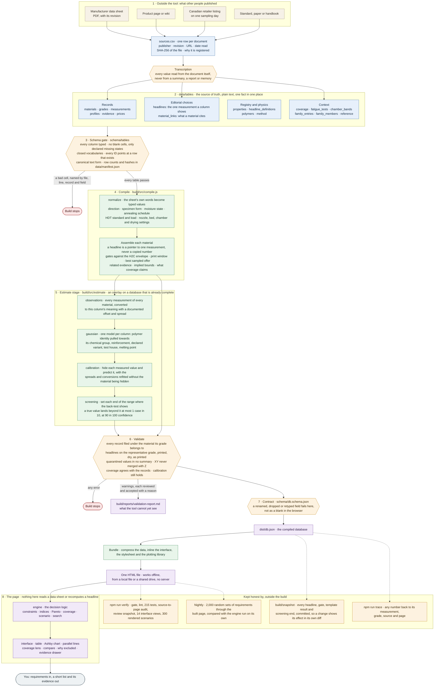
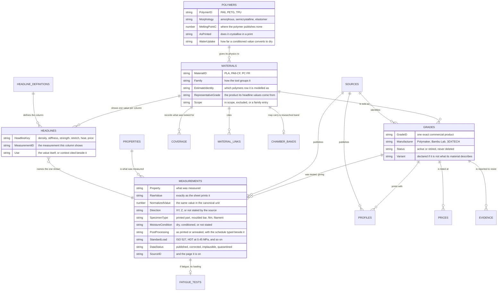
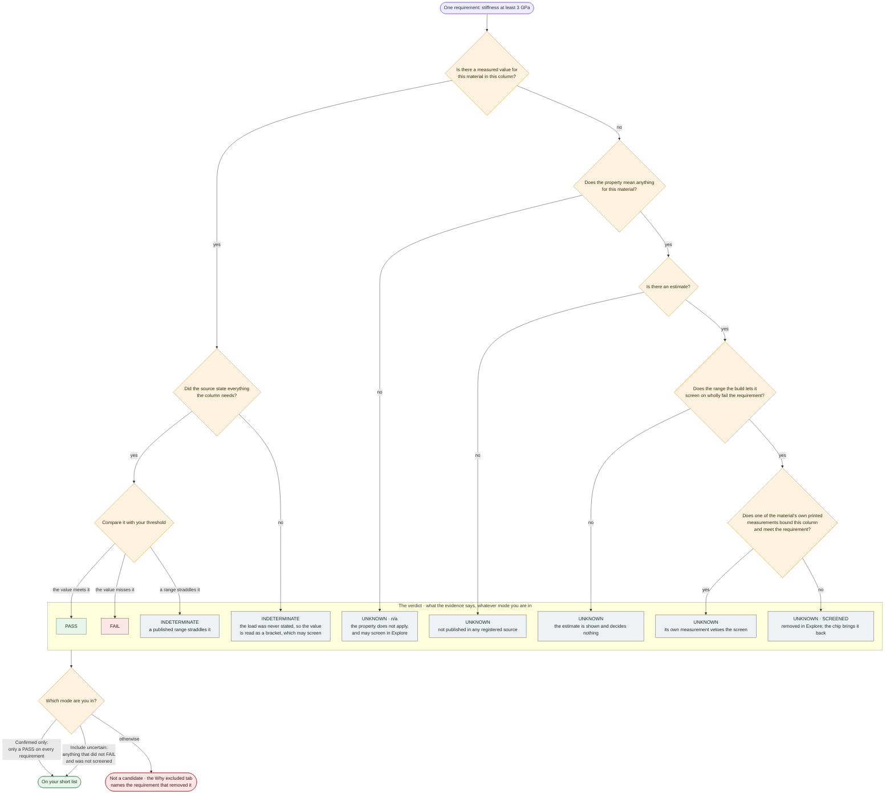

# How the material selector works, for an engineer using it

This is for someone choosing a filament for a part on a Bambu Lab H2C who wants to know where the numbers on the
screen come from, what each kind of number means, and how far to trust it. It assumes you read technical data sheets
and know what a tensile test is. It does not assume you have seen the code, and you do not need to.

Live tool: [pdynamics.ca/h2c-materials](https://pdynamics.ca/h2c-materials/). Everything below is also true of the
single HTML file you can download and open with no internet.

## What the tool is, and is not

The tool is a screening and comparison aid. You state requirements (stiffness at least 3 GPa, heat resistance at
least 100 °C, printable on the H2C, resists oils), and it tells you which of about a hundred filaments the recorded
evidence says pass, fail, or cannot be judged, and why, with a link from every number to the document it came from.

It is not a source of design allowables. Every value is what one manufacturer's data sheet says about one product
under that manufacturer's test, and printed parts vary with orientation, settings and moisture far more than moulded
ones. Use it to get to a short list quickly and honestly; then read the exact grade's data sheet and test the part.

## The path from a data sheet to a number on the screen

Seven stages, each a separate piece of the project, so that a mistake in one is caught before the next. Read the
diagram top to bottom: beige is the outside world, blue is data you can open in a text editor, green is computation,
amber is a check that can stop the build, purple is what ships. The dotted lines at the bottom are the checks that run
against the finished article rather than inside it.

Two properties of this shape are worth naming, because they are what make the numbers trustworthy.

**The build fails loudly rather than shipping something plausible.** Every amber box can stop it. A database that has
drifted cannot reach the page at all, so what you are reading was, at the moment it was built, consistent with every
rule the project asserts about itself.

**Estimates are a layer, not an ingredient.** Stage 5 only adds to the database stage 4 produced. The core builds and
validates without it, which is a check that runs on every commit. No measured value, gate or verdict can quietly
depend on inference.

### 1. Sources

Every document the database uses is registered once: publisher, title, revision, the date it was read, its URL, and
the SHA-256 hash of the file that was read. If a manufacturer silently changes a PDF, the hash no longer matches and
the build says so. A source that could not be retrieved is recorded as such and nothing may cite it.

### 2. Tables

The database is nineteen CSV files you can open in any editor. The ones that matter to a reader:

| Table | One row is |
|---|---|
| `materials` | a material as the tool lists it: PLA, PA6-CF, PC FR. An identity, not a product |
| `grades` | one exact commercial product from one manufacturer (Polymaker PolyMide PA6-CF, Bambu PC FR). A material has one or more |
| `measurements` | one published test result of one grade: the property, the value exactly as printed, the unit, the normalised value, the print direction, the specimen, the moisture and annealing state, the standard and load, the source and the page it is on |
| `profiles` | one product's recommended print settings (nozzle, bed, chamber, drying) with the source's own words kept beside the typed numbers |
| `evidence` | one qualitative statement: chemical resistance, food contact, UV, flammability, with its source |
| `prices` | one Canadian retail listing on one day |
| `headlines` | which single measurement stands for a material in each column of the table (see below) |
| `polymers` | what the estimate model knows about each polymer: crystallinity, melting point, water uptake, neat density |
| `coverage` | what was looked for and not found, so a blank is a recorded absence, not an oversight |

How they fit together. Crow's feet mark the "many" end: one material has many grades, one grade has many
measurements, one measurement is published in exactly one source.

Two rules shape all of them. **Nothing that can be calculated is stored**: a material's headline is a pointer to a
measurement, never a number typed twice; a per-kilogram price is computed from list price and net mass. **Nothing is
deleted**: a wrong or duplicated record is retired with a note, so the audit trail survives.

### 3. The gate and the build

Before anything is computed, every table is checked against a written schema: every column has a type, a required
value or an explicit "Not published" or "Not applicable" (a blank cell is an error, and nothing ever becomes zero),
every ID points at a row that exists, every categorical value is in a closed list. A mistake is reported by file,
line, record and field in about a tenth of a second.

The build then assembles the database and checks what a schema cannot: that a measurement is filed under the
material its grade belongs to, that a headline cites the material's own representative grade, that a value marked
"quarantined" reaches no summary, that the nozzle text "255-275 °C" and the typed numbers beside it agree. Any error
stops the build, so a database that has drifted can never reach the page. Warnings (an imprecise estimate, a heat
value whose load the sheet never stated) are listed per record and each has to be reviewed and accepted with a
written reason before the build is allowed to pass.

Estimates (below) are added last, as a separate layer over a database that is already complete and valid without
them.

### 4. The compiled database and the page

The result is one JSON file, checked against its own contract, then compressed into a single HTML file together
with the interface. The page never reads a data sheet, never computes a headline, and never reaches the network.
What it does compute is the selection: which materials meet your requirements. That logic lives in one place, is
tested on its own, and every night two thousand random sets of requirements are run through the rendered page and
compared with the same logic run outside the browser, so the screen cannot drift from the rules.

## The four kinds of number

This is the most important thing to know. The table shows them differently on purpose, and only the first one is
evidence.

| On screen | What it is | Can it satisfy a requirement? |
|---|---|---|
| `4.43` | **Measured.** One published value from the material's representative product, printed specimen, dry, as printed, in the direction the column names. Hover or open the drawer to see the measurement, the grade, the source and the page | Yes |
| `46*` | **Related.** A real measurement of the same property that was not promoted: another direction, another endpoint (yield instead of ultimate), a moulded resin value, an annealed part. Shown so you know something is known | No |
| `~71–92†` | **Estimated.** The likely range (80 %) of a statistical model of every observation in the database, converted to this column. Never a point, always a range | No. In Explore mode it can rule a material *out* |
| `n/a` | **Not applicable.** The property does not mean anything for this material (heat deflection of a rubber-like elastomer, structural values of a support material) | No; in Explore it screens the same way |
| `—` | **Not published** in any registered source. Hover to see which kind of absence | No |

Two marks qualify a measured value: `80?` means the source named the standard but not the load, so an HDT value of
80 °C may be at 0.45 MPa or 1.8 MPa and can neither pass nor fail a heat requirement outright; `35≈` means the
published mean ± spread contains your threshold, so the mean passes but some parts may not.

## Estimates: what they are and what they may do

About a third of the headline cells have no published value. Rather than leave them blank, the build estimates them
from everything else it knows: the material's own other measurements (a break strength where the ultimate strength
is missing, a flexural modulus where the tensile one is), its other grades, its resin supplier's sheet, and its
polymer family. Each piece of evidence is converted to the column's meaning with a documented offset and spread (a
Z-direction strength converts to an XY one with a wide spread; a break strength to an ultimate one with a narrow one),
and the whole model is checked by hiding every measured value in turn and predicting it: the 80 % range has to
contain the hidden value 80 % of the time, and the build fails if it does not.

Physics the model follows: a fibre raises a semicrystalline polymer's heat deflection towards its melting point but an
amorphous one's only a little past its glass transition; PET and PVA print amorphous and are treated as such; a
conditioned nylon converts to dry by its water uptake; a filled compound cannot be lighter than its polymer except by
porosity; an elastomer has no heat deflection temperature at all.

What an estimate may do is deliberately limited:

- **It never passes a material.** With estimates on, a material whose estimated stiffness is 3.1 to 4.5 GPa still
  reads UNKNOWN against "at least 3 GPa".
- **In Explore mode it may screen a material out**, but only on an end of its range the build has demonstrated. Every
  build hides each measured value as far as the estimate's kind of evidence would, predicts it, and sets the range's
  ends where a new true value falls beyond them no more than 10 % of the time with 90 % confidence. An end the
  material's own data contradict (PP's own 460 % elongation against a family range topping at 118 %) is left open and
  screens nothing. The drawer says, for each estimate, which ends may screen and why.
- **A material's own printed measurement can veto a screen.** If its published yield strength already meets your
  minimum, no estimate of its ultimate strength can remove it.

In Strict mode ("Confirmed only") estimates are neither shown nor used.

## The two modes and the four answers

Every requirement gets one of four answers per material: **PASS**, **FAIL**, **UNKNOWN** (no comparable evidence) and
**INDETERMINATE** (evidence exists and your threshold cuts through it: a published range of 90 to 120 °C against "at
least 100"). The mode decides what happens to the last two.

- **Confirmed only (Strict):** only materials with a PASS on every requirement are candidates. Measured evidence only.
  This is the mode for a shortlist you will act on.
- **Include uncertain (Explore):** materials with UNKNOWN or INDETERMINATE answers stay visible and flagged, so a gap
  in the database does not hide a material that might suit. With **Use estimates** on, estimates may screen as above.
  The SCREENED chip brings screened materials back.

The whole of that logic, for one requirement against one material, is this. The verdict always describes the evidence;
only the mode decides whether the material stays on your list.

The "Why excluded" tab lists which requirement removed how many materials, so you can see which of your requirements
is doing the work.

## Printability on the H2C

The printer's envelope (350 °C nozzle, 120 °C bed, 65 °C chamber) is compared with every product's published print
profile, and a material reports **within**, **exceeds**, **partial** (a chamber window the printer only partly reaches)
or **unknown**. A recommendation ("chamber recommended if possible") is not a requirement and never excludes. Where a
source says a heated chamber is not needed, that counts; "enclosure recommended" counts as nothing. A material with
no product at all shows an estimated nozzle and bed window, marked as such, that decides nothing.

## How to check a number yourself

- **Hover** a value for its measurement ID, grade and source. **Open the drawer** (click the row) for the full
  record: every measurement of the material with its conditions, every estimate with its evidence and limits, the
  print profiles with the source's own words, the chemical evidence with the sheet's own wording.
- **Compare** puts up to six materials side by side with the measurement conditions under each number, and prints.
- **Export** writes a CSV in which estimates are in their own column and can never be mistaken for measurements.
- If you have the repository: `npm run trace -- PETG` prints every headline of a material back to its source file,
  page and hash.

## What is deliberately not there

- No universal material score. Scores would hide which requirement did the work.
- No cross-property substitution: a glass transition is never shown in a heat-deflection column, and a flexural
  strength never stands in for a tensile one.
- No conversion between impact units (J/m and kJ/m²) without the specimen geometry the sheets do not give.
- No live prices. The price is a median of Canadian retail listings on one recorded day.

## Where the limits are

The tool is only as good as the sheets it read. Several products publish values physics rules out (a heat deflection
at 0.45 MPa below the one at 1.8 MPa; a 1.19 GPa modulus on a 68D elastomer); these are kept, flagged, and decide
nothing. Two materials have no measurements at all. Where a polymer has little data of its own, its estimates rest
on its family. The current list of known limits is kept in [DATA-MODEL.md](DATA-MODEL.md) under "Known limits of the
snapshot", and every build's validation report is published beside the page.

## Reading on

[DATA-MODEL.md](DATA-MODEL.md) explains every table and the estimate model in detail. [INTERFACE.md](INTERFACE.md)
explains every screen. [DECISIONS.md](DECISIONS.md) records why each rule is what it is and what broke before it was.
[audits/](audits/) holds every review of the tool and its data, with what was done about each finding.
