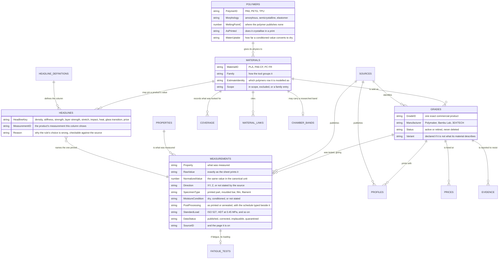
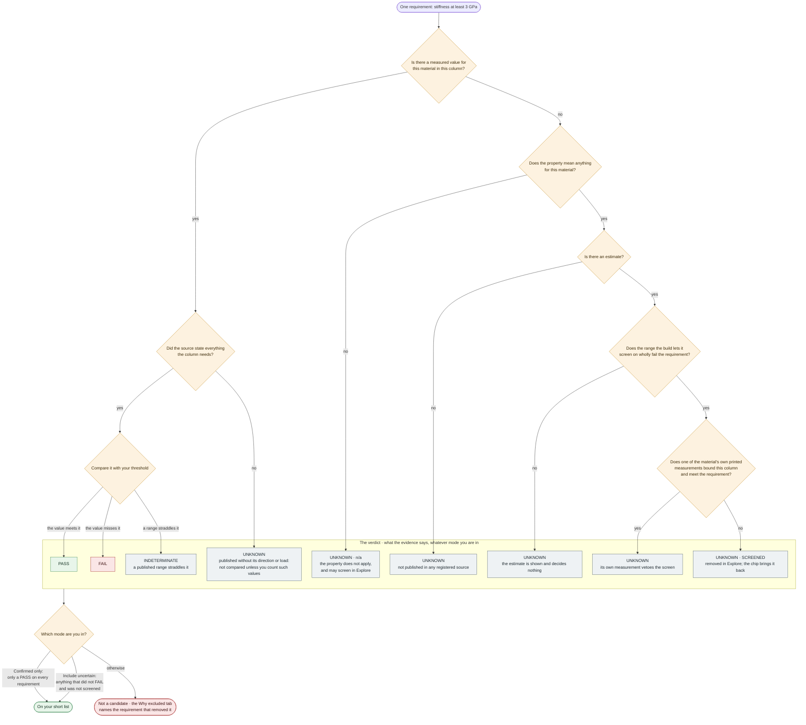

# How the material selector works, for an engineer using it

This is for someone choosing a filament for a part on a Bambu Lab H2C who wants to know where the numbers on the
screen come from, what each kind of number means, and how far to trust it. It assumes you read technical data sheets
and know what a tensile test is. It does not assume you have seen the code, and you do not need to.

Live tool: [pdynamics.ca/h2c-materials](https://pdynamics.ca/h2c-materials/). Everything below is also true of the
single HTML file you can download and open with no internet.

## What the tool is, and is not

The tool is a screening and comparison aid. You state requirements (stiffness at least 3 GPa, heat resistance at
least 100 °C, printable on the H2C, resists oils), and it tells you which of the materials in the database have products the recorded
evidence says pass, fail, or cannot be judged, which products those are, and why, with a link from every number to the document it came from.

It is not a source of design allowables. Every value is what one manufacturer's data sheet says about one product
under that manufacturer's test, and printed parts vary with orientation, settings and moisture far more than moulded
ones. Use it to get to a short list quickly and honestly; then read the exact grade's data sheet and test the part.

## The path from a data sheet to a number on the screen

Seven stages, each a separate piece of the project, so that a mistake in one is caught before the next. Read the
diagram top to bottom: beige is the outside world, blue is data you can open in a text editor, green is computation,
amber is a check that can stop the build, purple is what ships. The dotted lines at the bottom are the checks that run
against the finished article rather than inside it.

```mermaid
%%{init: {"flowchart": {"wrappingWidth": 340, "nodeSpacing": 45, "rankSpacing": 55, "curve": "basis"}}}%%
flowchart TB
    subgraph WORLD["1 · Outside the tool: what other people published"]
        direction LR
        TDS["Manufacturer data sheet<br/>PDF, with its revision"]
        WEB["Product page or wiki"]
        SHOP["Retailer listing, Canadian first<br/>on the day it was read"]
        LIT["Standard, paper or handbook"]
    end

    SRCS["sources.csv · one row per document<br/>publisher · revision · URL · date read<br/>SHA-256 of the file · why it is registered"]
    TRAN{{"Transcription<br/>every value read from the document itself,<br/>never from a summary, a report or memory"}}

    TDS --> SRCS
    WEB --> SRCS
    SHOP --> SRCS
    LIT --> SRCS
    SRCS --> TRAN

    subgraph TBL["2 · data/tables · the source of truth, plain text, one fact in one place"]
        direction LR
        REC["Records<br/>materials · grades · measurements<br/>profiles · evidence · prices"]
        SEL["Editorial choices<br/>headlines: a pin, where the rule picks the wrong<br/>measurement for one product (normally empty)<br/>material_links: what a material cites"]
        REGI["Registry and physics<br/>properties · headline_definitions<br/>polymers · method"]
        CTX["Context<br/>coverage · fatigue_tests · chamber_bands · polymer_environment<br/>print_guide · print_guide_materials<br/>family_entries · family_members · reference"]
    end
    TRAN --> REC
    TRAN --> SEL
    TRAN --> CTX

    GATE{{"3 · Schema gate · schema/tables<br/>every column typed · no blank cells, only declared missing states<br/>closed vocabularies · every ID points at a row that exists<br/>canonical text form · row counts and hashes in data/manifest.json"}}
    TBL --> GATE
    GATE -- "a bad cell, named by file, line, record and field" --> STOP1(["Build stops"])

    subgraph CMPL["4 · Compile · build/src/compile.js"]
        direction TB
        NORM["normalize · the sheet's own words become typed values<br/>direction · specimen form · moisture state · annealing schedule<br/>HDT standard and load · nozzle, bed, chamber and drying settings"]
        ASSM["Assemble each material<br/>each product's value chosen by rule from its own measurements<br/>a material's headline is its products' spread, never a copied number<br/>gates against the H2C envelope · print window · best sampled offer<br/>related evidence · implied bounds · what coverage claims"]
        NORM --> ASSM
    end
    GATE -- "every table passes" --> NORM

    subgraph ESTG["5 · Estimate stage · build/src/estimate · an overlay on a database that is already complete"]
        direction TB
        OBSV["observations · every measurement of every material, converted<br/>to this column's meaning with a documented offset and spread"]
        GAUS["gaussian · one model per column: polymer identity pulled towards<br/>its chemical group, reinforcement, declared variant, test house, melting point"]
        CALB["calibration · hide each measured value and predict it, with the<br/>spreads and conversions refitted without the material being hidden"]
        SCRN["screening · set each end of the range where the back-test shows<br/>a true value lands beyond it at most 1 case in 10, at 90 in 100 confidence"]
        OBSV --> GAUS --> CALB --> SCRN
    end
    ASSM --> OBSV

    VALD{{"6 · Validate<br/>every record filed under the material its grade belongs to<br/>each product value its own grade's, or its twin's where the two<br/>print one table · printed, dry, as printed<br/>quarantined values in no summary · XY never merged with Z<br/>coverage agrees with the records · calibration still holds"}}
    ASSM --> VALD
    SCRN --> VALD
    VALD -- "any error" --> STOP2(["Build stops"])
    VALD -- "warnings, each reviewed<br/>and accepted with a reason" --> RPT["build/reports/validation-report.md<br/>what the tool cannot yet see"]

    CTRT{{"7 · Contract · schema/db.schema.json<br/>a renamed, dropped or retyped field fails here,<br/>not as a blank in the browser"}}
    VALD --> CTRT
    CTRT --> DBJS["dist/db.json · the compiled database"]
    DBJS --> BNDL["Bundle · compress the data, inline the interface,<br/>the stylesheet and the plotting library"]
    BNDL --> HTML["One HTML file · works offline,<br/>from a local file or a shared drive, no server"]

    subgraph PAGE["8 · The page · nothing here reads a data sheet or recomputes a headline"]
        direction LR
        ENGN["engine · the decision logic<br/>constraints · indices · Pareto · coverage · scenario · search"]
        UIML["interface · table · Ashby chart · parallel lines<br/>coverage lens · compare · why excluded · evidence drawer"]
        ENGN --> UIML
    end
    HTML --> ENGN
    UIML --> USER(["You: requirements in, a short list and its evidence out"])

    subgraph CHK["Kept honest by, outside the build"]
        direction LR
        CK1["npm run verify · gate, lint, tests, source-to-page audit,<br/>review snapshot, interface views, 300 rendered scenarios"]
        CK2["build/snapshot · every headline, gate, template result and<br/>screening end, committed, so a change shows its effect in its own diff"]
        CK3["Nightly · 2,000 random sets of requirements through the<br/>built page, compared with the engine run on its own"]
        CK4["npm run trace · any number back to its measurement,<br/>grade, source and page"]
    end
    HTML -.-> CK1
    DBJS -.-> CK2
    HTML -.-> CK3
    DBJS -.-> CK4

    classDef world fill:#f6f1e7,stroke:#a2957c,color:#2f2a20
    classDef data fill:#e7f0fb,stroke:#3a6ea5,color:#10283f
    classDef build fill:#e8f5ea,stroke:#3f8b58,color:#123020
    classDef check fill:#fdf2e0,stroke:#c2891c,color:#3b2a08
    classDef ship fill:#f1e9f8,stroke:#7a4fa6,color:#291640
    classDef stop fill:#fae6e6,stroke:#a83232,color:#3d1111
    classDef you fill:#eef2f4,stroke:#54646e,color:#1d282e

    class TDS,WEB,SHOP,LIT world
    class SRCS,REC,SEL,REGI,CTX data
    class NORM,ASSM,OBSV,GAUS,CALB,SCRN,BNDL build
    class TRAN,GATE,VALD,CTRT,CK1,CK2,CK3,CK4 check
    class DBJS,HTML,RPT,ENGN,UIML ship
    class STOP1,STOP2 stop
    class USER you
```

Two properties of this shape are worth naming, because they are what make the numbers trustworthy.

**The build fails loudly rather than shipping something plausible.** Every amber box can stop it. A database that has
drifted cannot reach the page at all, so what you are reading was, at the moment it was built, consistent with every
rule the project asserts about itself.

**Estimates are a layer, not an ingredient.** Stage 5 only adds to the database stage 4 produced. The core builds and
validates without it, which is a check that runs on every commit. No measured value, gate or verdict can quietly
depend on inference.

### 1. Sources

Every document the database uses is registered once: publisher, title, revision, the date it was read, its URL, and
the SHA-256 hash of the file that was read. If a manufacturer silently changes a PDF, the hash no longer matches when
the document is fetched again, and `npm run audit:sources` reports it. A source that could not be retrieved is recorded
as such and nothing may cite it.

### 2. Tables

The database is a set of CSV files in `data/tables` you can open in any editor. The ones that matter to a reader:

| Table | One row is |
|---|---|
| `materials` | a material as the tool lists it: PLA, PA6-CF, PC FR. An identity, not a product |
| `grades` | one exact commercial product from one manufacturer (Polymaker FIBERON PA6 CF20, Bambu Lab PC FR). A material has one or more |
| `measurements` | one published test result of one grade: the property, the value exactly as printed, the unit, the normalised value, the print direction, the specimen, the moisture and annealing state, the standard and load, the source and the page it is on |
| `profiles` | one product's recommended print settings (nozzle, bed, chamber, drying) with the source's own words kept beside the typed numbers |
| `evidence` | one qualitative statement: chemical resistance, food contact, UV, flammability, with its source |
| `prices` | one retail listing on one day: Canadian in CAD, or foreign in its own currency (D113) |
| `headlines` | a pin: the measurement that is one product's value where the rule would choose another, with a reason. Normally empty |
| `polymers` | what the estimate model knows about each polymer: crystallinity, melting point, water uptake, neat density |
| `coverage` | what was looked for and not found, so a blank is a recorded absence, not an oversight |

How they fit together. Crow's feet mark the "many" end: one material has many grades, one grade has many
measurements, one measurement is published in exactly one source.

```mermaid
erDiagram
    POLYMERS ||--o{ MATERIALS : "gives its physics to"
    MATERIALS ||--o{ GRADES : "is sold as"
    MATERIALS ||--o{ HEADLINES : "may pin a product's value"
    MATERIALS ||--o{ COVERAGE : "records what was looked for"
    MATERIALS ||--o{ MATERIAL_LINKS : "cites"
    MATERIALS ||--o| CHAMBER_BANDS : "may carry a researched band"
    GRADES ||--o{ MEASUREMENTS : "was tested, giving"
    GRADES ||--o{ PROFILES : "prints with"
    GRADES ||--o{ PRICES : "is listed at"
    GRADES ||--o{ EVIDENCE : "is reported to resist"
    SOURCES ||--o{ MEASUREMENTS : "publishes"
    SOURCES ||--o{ PROFILES : "publishes"
    SOURCES ||--o{ GRADES : "identifies"
    PROPERTIES ||--o{ MEASUREMENTS : "is what was measured"
    HEADLINE_DEFINITIONS ||--o{ HEADLINES : "defines the column"
    HEADLINES }o--|| MEASUREMENTS : "names the one pinned"
    MEASUREMENTS ||--o| FATIGUE_TESTS : "if fatigue, its loading"

    MATERIALS {
        string MaterialID "PLA, PA6-CF, PC FR"
        string Family "how the tool groups it"
        string EstimateIdentity "which polymers row it is modelled as"
        string Scope "in scope, excluded, or a family entry"
    }
    GRADES {
        string GradeID "one exact commercial product"
        string Manufacturer "Polymaker, Bambu Lab, 3DXTECH"
        string Status "active or retired, never deleted"
        string Variant "declared if it is not what its material describes"
    }
    MEASUREMENTS {
        string Property "what was measured"
        string RawValue "exactly as the sheet prints it"
        number NormalizedValue "the same value in the canonical unit"
        string Direction "XY, Z, or not stated by the source"
        string SpecimenType "printed part, moulded bar, film, filament"
        string MoistureCondition "dry, conditioned, or not stated"
        string PostProcessing "as printed or annealed, with the schedule typed beside it"
        string StandardLoad "ISO 527, HDT at 0.45 MPa, and so on"
        string DataStatus "published, corrected, implausible, quarantined"
        string SourceID "and the page it is on"
    }
    HEADLINES {
        string HeadlineKey "density, stiffness, strength, layer strength, stretch, impact, heat, glass transition, price"
        string MeasurementID "the product's measurement this column shows"
        string Reason "why the rule's choice is wrong, checkable against the source"
    }
    POLYMERS {
        string PolymerID "PA6, PETG, TPU"
        string Morphology "amorphous, semicrystalline, elastomer"
        number MeltingPointC "where the polymer publishes none"
        string AsPrinted "does it crystallise in a print"
        string WaterUptake "how far a conditioned value converts to dry"
    }
```

Two rules shape all of them. **Nothing that can be calculated is stored**: a product's value is a pointer to its
measurement, and a material's headline is computed from its products, never a number typed twice; a per-kilogram price
is computed from list price and net mass. **Nothing is
deleted**: a wrong or duplicated record is retired with a note, so the audit trail survives.

### 3. The gate and the build

Before anything is computed, every table is checked against a written schema: every column has a type, a required
value or an explicit "Not published" or "Not applicable" (a blank cell is an error, and nothing ever becomes zero),
every ID points at a row that exists, every categorical value is in a closed list. A mistake is reported by file,
line, record and field in under a second.

The build then assembles the database and checks what a schema cannot: that a measurement is filed under the
material its grade belongs to, that a product's value cites that product's own measurement, or its twin's where the two
print one table, that a value marked "quarantined" reaches no summary, that the nozzle text "255-275 °C" and the typed
numbers beside it agree. Any error stops the build, so a database that has drifted can never reach the page. Warnings
that need a reviewer (an outlier, an estimate left imprecise beside a usable published value, a reinforced material
below its unfilled sibling, a material with no measurements) are listed per record, and each has to be fixed or
accepted with a written reason before `npm run verify` passes.

Estimates (below) are added last, as a separate layer over a database that is already complete and valid without
them.

### 4. The compiled database and the page

The result is one JSON file, checked against its own contract, then compressed into a single HTML file together
with the interface. The page never reads a data sheet, never computes a headline, and never reaches the network.
What it does compute is the selection: which materials meet your requirements. That logic lives in one place, is
tested on its own, and every night two thousand random sets of requirements are run through the rendered page and
compared with the same logic run outside the browser, so the screen cannot drift from the rules.

## A material is the spread of its products

A material such as PLA is not one number: its two hundred products differ. Each product's own values are chosen from
its own data sheet by a fixed rule (a printed or unstated specimen, the column's direction, dry or unstated, as
printed), and a material's cell shows **the typical value of its products (their median), with their range and how
many products under it**: `2.45` over `0.95–4.24 · 38` for PLA's stiffness. The range is different products, not the
uncertainty of one.

A requirement is checked **product by product, all requirements at once**, including whether the H2C can print that
product on its own settings. A material passes when at least one of its products meets everything, and the result says
how many: `PASS · 1 of 4` means one of the four products that could be judged meets every requirement. It stays
unknown while any product could not be judged and none passes, and fails only when every product fails (D100): one
measured failure does not rule out products nobody has measured. Products that publish too little to judge are counted
but never held against the material. Open the material's **Products** tab: the products that pass come first, each with
the state it passed in, how to print it, its own numbers and what its maker says about it.

**A product's evidence is its own** (D98). Its chemical and water records, its stock, its conflicts and its exact-grade
measurements are its own, or its twin's (a product that prints the same sheet, D89); another product's record, or one
filed under the whole material, is shown as context and never passes it.

**A product is judged in a state it can be made in** (D99). Many sheets measure some values after annealing (Bambu
Lab's PA6-CF, all of them at 80 °C for 12 h) or after moisture conditioning. A product is judged **as printed** unless
you tick **We can anneal parts** under *How the part is made and used*, and then also annealed at the schedule its own
sheet states (up to your oven's temperature, if you give one); it is judged **dry** unless you say the part lives
**conditioned by the air's moisture**, and then only on conditioned values. Two states are never mixed into one part: a
value measured annealed does not pass an as-printed product, and the reason says where it was published ("Published only
after annealing at 90 °C for 4 h; permit annealing to judge it in that state"). A verdict in an annealed state names the
annealing it needs. The results header says how every product is judged, and how many more materials annealing would
pass. Every value also says which conditions its sheet left unstated and the screening policy admits (specimen form,
moisture state, treatment) and the method it names: "comparable" is a screening policy, not a laboratory equivalence.

Values whose source does not state the test direction or load are counted apart: they often read like moulded bars
(of PLA's products, 3 of the 38 that state an XY stiffness reach 3 GPa; 27 of the 41 that state no direction claim 3
GPa or more). They are shown and not compared, unless you tick **Also count values published without their test
direction or load** in the Evidence filters. The layer strength never counts a value with no stated direction, ticked
or not: a bar pulled in an unstated direction is not a bar pulled across the layers (D92).

## The four kinds of number

This is the most important thing to know. The table shows them differently on purpose, and only the first one is
evidence.

| On screen | What it is | Can it satisfy a requirement? |
|---|---|---|
| `2.45` over `0.95–4.24 · 38` | **Measured, across products.** The typical value of the products that publish it comparably, their range and how many. Select it for the details, and the material's Products tab for each product's own measurement, grade, source and page | Yes, product by product |
| `4.43` | **Measured, one product.** The only product that publishes it comparably | Yes |
| `46*` | **Related.** A real measurement of the same property that was not promoted: another direction, another endpoint (elongation at yield in the stretch column), a moulded resin value, an annealed part. Shown so you know something is known | No |
| `~71–92†` | **Estimated.** The likely range (80 %) of a statistical model of every observation in the database, converted to this column. Never a point, always a range | No. In Explore mode it can rule a material *out* |
| `n/a` | **Not applicable.** The property does not mean anything for this material (heat deflection of a rubber-like elastomer, structural values of a support material) | No; in Explore it screens the same way |
| `—` | **Not published** in any registered source. Hover to see which kind of absence | No |

One mark qualifies a measured value: `35≈` means the published mean ± spread contains your threshold, so the mean
passes but some parts may not. A heat value whose source names no load is counted apart, like a value with no stated
direction.

## Estimates: what they are and what they may do

Many headline cells have no published value ([build/snapshot/counts.md](../build/snapshot/counts.md) counts the cells
products fill and the ones estimated). In the five columns the model covers (density, stiffness, strength, stretch and
heat resistance), rather than leave them blank, the build estimates them from everything else it knows: the
material's own other measurements (a break strength where the ultimate strength is missing, a flexural modulus where
the tensile one is), its other grades, its resin supplier's sheet, and its polymer family. Each piece of evidence is
converted to the column's meaning with a documented offset and spread (a Z-direction strength converts to an XY one
with a wide spread; a break strength to an ultimate one with a narrow one), and the whole model is checked by hiding
every measured value in turn and predicting it: the 80 % range has to contain the hidden value 80 % of the time, and
the build fails if it does not.

Physics the model follows: a fibre raises a semicrystalline polymer's heat deflection towards its melting point but an
amorphous one's only a little past its glass transition; PET and PVA print amorphous and are treated as such; a
conditioned nylon converts to dry by its water uptake; a filled compound cannot be lighter than its polymer except by
porosity; an elastomer has no heat deflection temperature at all.

What an estimate may do is deliberately limited:

- **It never passes a material.** With estimates on, a material whose estimated stiffness is 3.1 to 4.5 GPa still
  reads UNKNOWN against "at least 3 GPa".
- **In Explore mode it may screen a material out**, but only on an end of its range the build has demonstrated. Every
  build hides each measured value as far as the estimate's kind of evidence would, predicts it, and sets the range's
  ends where a new true value falls beyond them no more than 10 % of the time with 90 % confidence. An end the
  material's own data contradict (PA6's own 51 % elongation, above the range the model would screen on) is left open
  and screens nothing. The drawer says, for each estimate, which ends may screen and why.
- **A material's own printed measurement can veto a screen.** If its published yield strength already meets your
  minimum, no estimate of its ultimate strength can remove it.

In Strict mode ("Confirmed only") estimates are neither shown nor used.

## The two modes and the four answers

Every requirement gets one of four answers per material: **PASS**, **FAIL**, **UNKNOWN** (no comparable evidence) and
**INDETERMINATE** (evidence exists and your threshold cuts through it: a published range of 90 to 120 °C against "at
least 100"). The mode decides what happens to the last two.

- **Confirmed only (Strict):** only materials with a PASS on every requirement are candidates. Measured evidence only.
  This is the mode for a shortlist you will act on.
- **Include uncertain (Explore):** materials with UNKNOWN or INDETERMINATE answers stay visible and flagged, so a gap
  in the database does not hide a material that might suit. With **Use estimates and polymer data** on, estimates may
  screen as above, and so may a base polymer's published behaviour where the material has no record of its own in a
  category and the reference finds the polymer resistant to nothing in it (D64). The SCREENED chip brings screened
  materials back.

The whole of that logic, for one requirement against one material, is this. The verdict always describes the evidence;
only the mode decides whether the material stays on your list.

```mermaid
%%{init: {"flowchart": {"wrappingWidth": 300, "nodeSpacing": 40, "rankSpacing": 60, "curve": "basis"}}}%%
flowchart TB
    REQ(["One requirement: stiffness at least 3 GPa"]) --> HASV{"Is there a measured value for<br/>this material in this column?"}
    HASV -- "yes" --> COMPLETE{"Did the source state everything<br/>the column needs?"}
    HASV -- "no" --> APPL{"Does the property mean anything<br/>for this material?"}
    COMPLETE -- "yes" --> CMPV{"Compare it with your threshold"}
    APPL -- "yes" --> ESTQ{"Is there an estimate?"}
    ESTQ -- "yes" --> SCRQ{"Does the range the build lets it<br/>screen on wholly fail the requirement?"}
    SCRQ -- "yes" --> VETO{"Does one of the material's own printed<br/>measurements bound this column<br/>and meet the requirement?"}

    subgraph OUTC["The verdict · what the evidence says, whatever mode you are in"]
        direction LR
        PASS["PASS"]
        FAILV["FAIL"]
        INDT["INDETERMINATE<br/>a published range straddles it"]
        ASPB["UNKNOWN<br/>published without its direction or load:<br/>not compared unless you count such values"]
        NAPP["UNKNOWN · n/a<br/>the property does not apply,<br/>and may screen in Explore"]
        UNK1["UNKNOWN<br/>not published in any registered source"]
        UNK2["UNKNOWN<br/>the estimate is shown and decides nothing"]
        UNK3["UNKNOWN<br/>its own measurement vetoes the screen"]
        SCRD["UNKNOWN · SCREENED<br/>removed in Explore; the chip brings it back"]
    end

    CMPV -- "the value meets it" --> PASS
    CMPV -- "the value misses it" --> FAILV
    CMPV -- "a range straddles it" --> INDT
    COMPLETE -- "no" --> ASPB
    APPL -- "no" --> NAPP
    ESTQ -- "no" --> UNK1
    SCRQ -- "no" --> UNK2
    VETO -- "yes" --> UNK3
    VETO -- "no" --> SCRD

    OUTC --> MODE{"Which mode are you in?"}
    MODE -- "Confirmed only:<br/>only a PASS on every requirement" --> KEEP(["On your short list"])
    MODE -- "Include uncertain:<br/>anything that did not FAIL<br/>and was not screened" --> KEEP
    MODE -- "otherwise" --> DROP(["Not a candidate · the Why excluded tab<br/>names the requirement that removed it"])

    classDef good fill:#e8f5ea,stroke:#3f8b58,color:#123020
    classDef bad fill:#fae6e6,stroke:#a83232,color:#3d1111
    classDef grey fill:#eef2f4,stroke:#54646e,color:#1d282e
    classDef ask fill:#fdf2e0,stroke:#c2891c,color:#3b2a08

    class PASS,KEEP good
    class FAILV,DROP bad
    class INDT,ASPB,NAPP,UNK1,UNK2,UNK3,SCRD grey
    class HASV,COMPLETE,CMPV,APPL,ESTQ,SCRQ,VETO,MODE ask
```

The "Why excluded" tab lists which requirement removed how many materials, so you can see which of your requirements
is doing the work. A material is removed by a requirement only when every one of its products fails it.

When nothing is confirmed, the page says which of three answers it is: every material was measured and failed (relax a
requirement); none could be confirmed from the records at all (the database lacks the evidence, which says nothing about
the materials: keep the requirement, and test); or some of each.

## Printability on the H2C

Every ready-made template asks it (D101): **Printable on the H2C**, in the filters and as one requirement in the header.
Without it the page is in **research mode**, and says so: a pass then says nothing about printing the product.

The printer's envelope (350 °C nozzle, 120 °C bed, 65 °C chamber) is compared with each product's own published print
profile, and each product reports **within**, **exceeds**, **partial** (a chamber window the printer only partly
reaches), **recommended higher** (a recommended window above the H2C's) or **unknown**. Where its own sheet says
nothing on a part, a product reads its twin's sheet (another product of the same material that prints the same table,
D89), then Bambu Lab's Filament Guide for its type (D88), each labelled as such wherever it is shown; its own sheet
always wins, and a part none of them states is unknown, never a pass. A material's printability is its products': the
drawer counts how many of them the H2C can print on each axis, and a requirement on printing is met by a product that
meets it together with every other requirement. A recommendation ("chamber recommended if possible") is not a
requirement and never fails a product. Where a source says a heated chamber is not needed, that counts. For the eleven
types the guide asks an enclosure for (ABS, ABS-GF, ASA, ASA-CF, PC, PC FR, PAHT-CF, PA6-CF, PA6-GF, PPA-CF, PPS-CF), an
enclosure asked for with no temperature, by the guide or by the product's own maker, is met by the H2C's heated chamber
(D90, D93); for any other type "enclosure recommended" counts as nothing. A material whose sources publish no nozzle or bed
window shows an estimated one, marked as such, that decides nothing.

## Choosing a product and handing it on

When a product is the one the team will print, **Choose this product** in its material's Products tab. The scenario
keeps it with the state its answer was in and the release it was chosen on. Under **Save / share**, each chosen product
has a **decision brief** (Markdown): the question; the verdict and state, with the annealing it needs; every requirement
with the records it rests on, each number as printed with its source, page and SHA-256; what is not settled; how to print
and treat it; a suggested confirmation test; and the team's own test results, which you record there and which never
enter the database (D103).

Every page, saved scenario, link, export and brief carries a **release** ID: a digest of the data, the rules and the
engine that decided it (D96). Reopened on another release, even of the same data date, a scenario says so before it asks
its question again; every release published from `main` keeps its page as the GitHub release `h2c-<release>`.

## How to check a number yourself

- **Select** a value: one product's opens its measurement, with its grade and source; a material's typical value says
  what it rests on and offers **Open its products**, the drawer's Products tab. **Open the drawer** (click the row)
  for the full record: every measurement of the material with its conditions, every estimate with its evidence and
  limits, each product's own values and print settings, the print profiles with the source's own words, the chemical
  evidence with the sheet's own wording.
- **Compare** puts up to six materials side by side with the measurement conditions under each number, and prints.
- **Export** writes a CSV in which estimates are in their own column and can never be mistaken for measurements.
- If you have the repository: `npm run trace -- PETG` prints every headline of a material back to its source file,
  page and hash.

## What is deliberately not there

- No universal material score. Scores would hide which requirement did the work.
- No cross-property substitution: a glass transition is never shown in a heat-deflection column, and a flexural
  strength never stands in for a tensile one.
- No conversion between impact units (J/m and kJ/m²) without the specimen geometry the sheets do not give.
- No live prices. The price is a median of retail listings on the days they were read: Canadian where one exists, and
  otherwise a foreign one converted at one Bank of Canada rate, marked as converted (D113). No shipping or duty.

## Where the limits are

The tool is only as good as the sheets it read. Several products publish values physics rules out (a heat deflection
at 0.45 MPa below the one at 1.8 MPa; a 1.19 GPa modulus on a 68D elastomer); these are kept, flagged, and decide
nothing. Two materials have no measurements at all. Where a polymer has little data of its own, its estimates rest
on its family. The current list of known limits is kept in [DATA-MODEL.md](DATA-MODEL.md) under "Known limits of the
snapshot", and every build's validation report is published beside the page.

## Reading on

[DATA-MODEL.md](DATA-MODEL.md) explains every table and the estimate model in detail. [INTERFACE.md](INTERFACE.md)
explains every screen. [DECISIONS.md](DECISIONS.md) records why each rule is what it is and what broke before it was.
[audits/](audits/) holds every review of the tool and its data, with what was done about each finding.
